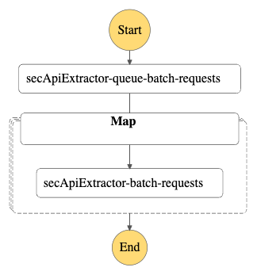

<h1>Edgar Mapper: Monthly SEC Edgar Data (10K: item 1)</h1>

<p><strong>Step Function Structure:</strong></p>
<p align="center">

</p>
<hr>

<h2>main.py</h2>

<p>Description</p>
<ol>
  <li><strong>lambda_sec_extractor_queue_batch_requests():</strong><br> Description</li>
  <li><strong>lambda_sec_extractor_batch_requests():</strong> <br>Description</li>
  <li><strong>save_to_s3_sec_url_by_date:</strong><br> Description 
<pre>
clai-edgar
    |-source=sec_api
       |- form_type={form_type}
          |- filingdate={date}
             |- accessionno={accesion_no}
                 |- item=1.json.gz
</pre></li>
</ol>

<h3>def lambda_sec_extractor_queue_batch_requests(event, context):</h3>

<p>The <code>lambda_sec_extractor_queue_batch_requests</code> function creates a list of JSON objects (dictionaries) to be processed by the <code>lambda_sec_extractor_batch_requests</code>. This process is dependent on the <code>sec_url_results</code> table in AWS Athena, from which it extracts the URL links used in the extraction process. Additionally, the process requires several variables in the <code>config.py</code> file to be set.</p>
   <h4>Inputs</h4>
    <ul>  <ul>
        <li><strong>event</strong> = <code>None</code>No arguments required </li>
        <li><strong>context</strong> = <code>None</code> No arguments required</li>
        <li><strong><code>config.py</code> Variables</strong></li>
        <ul>
            <li>item_10k = "1"</li>
            <li>item_10Q = "" </li>
            <li>item_8k = ""</li>
        </ul>
    </ul>


<p>This SQL query retrieves distinct records from the <code>sec_url_results</code> table in AWS Athena where the <code>formtype</code> is '10-K', the form we want to extract content from.</p>


```python
sql_query_string = "SELECT DISTINCT(sec.linktotxt) , sec.formtype, sec.accessionno, filedat FROM sec_url_results AS sec WHERE sec.formtype in ('10-K');"
```

<p>The <code>df_secApiUrls</code> is a pandas DataFrame returned by the <code>clai</code> database from AWS Athena. It uses the query set in <code>sql_query_string</code> above to retrieve the table.</p>


```python
df_secApiUrls = clai.query(sql_string=sql_query_string, database="clai")
```


<div align="center">
<table border="1" class="dataframe">
  <thead>
    <tr style="text-align: center;">
      <th></th>
      <th>linktotxt</th>
      <th>formtype</th>
      <th>accessionno</th>
      <th>filedat</th>
    </tr>
  </thead>
  <tbody>
    <tr>
      <th>0</th>
      <td>https://www.sec.gov/Archives/edgar/data/139410...</td>
      <td>10-K</td>
      <td>0001554795-23-000198</td>
      <td>2023-06-30T17:12:54-04:00</td>
    </tr>
    <tr>
      <th>1</th>
      <td>https://www.sec.gov/Archives/edgar/data/8177/0...</td>
      <td>10-K</td>
      <td>0001140361-23-032391</td>
      <td>2023-06-30T14:33:09-04:00</td>
    </tr>
    <tr>
      <th>2</th>
      <td>https://www.sec.gov/Archives/edgar/data/108455...</td>
      <td>10-K</td>
      <td>0001683168-23-004574</td>
      <td>2023-06-30T12:24:57-04:00</td>
    </tr>
    <tr>
      <th>3</th>
      <td>https://www.sec.gov/Archives/edgar/data/178881...</td>
      <td>10-K</td>
      <td>0001193125-23-178453</td>
      <td>2023-06-29T14:24:51-04:00</td>
    </tr>
    <tr>
      <th>4</th>
      <td>https://www.sec.gov/Archives/edgar/data/177587...</td>
      <td>10-K</td>
      <td>0001193125-23-178449</td>
      <td>2023-06-29T14:22:50-04:00</td>
    </tr>
  </tbody>
</table>
</div>


This process add a new col called <code>item</code> with the filling section the function is trying to extract. This item can be a list or a string This process adds a new column called <code>item</code>, which specifies the section the extraction is attempting to extract. This <code>'item'</code> can be either a list or a string and is in the <code>config.py</code> file

<h4>Available items:</h4>
<ul>
  <li>10K: <code>1, 1A, 1B, 2, 3, 4, 5, 6, 7, 7A, 8, 9, 9A, 9B, 10, 11, 12, 13, 14, 15</code></li>
  <li>10Q: <code>part1item1, part1item2, part1item3, part1item4, part2item1, part2item1a, part2item2, part2item3, part2item4, part2item5, part2item6</code></li>
  <li>8K: <code>1-1, 1-2, 1-3, 1-4, 2-1, 2-2, 2-3, 2-4, 2-5, 2-6, 3-1, 3-2, 3-3, 4-1, 4-2, 5-1, 5-2, 5-3, 5-4, 5-5, 5-6, 5-7, 5-8, 6-1, 6-2, 6-3, 6-4, 6-5, 6-6, 6-10, 7-1, 8-1, 9-1, signature</code></li>
</ul>


```python
# Adds a new column with the items to extract from each filing
filling_item_10K = config.item_10k # item 1 is "1" see sec_api for details
filling_item_10Q = config.item_10Q
filling_item_8K = config.item_8k  
# filling the item col using apply on rows 
df_secApiUrls['item'] = df_secApiUrls.apply(lambda x: filling_item_10K if x['formtype'] == '10-K' else (filling_item_10Q if x['formtype'] == '10-Q' else filling_item_8K), axis=1)
```


<div align="center"> 
<table border="1" class="dataframe">
  <thead>
    <tr style="text-align: center;">
      <th></th>
      <th>linktotxt</th>
      <th>formtype</th>
      <th>accessionno</th>
      <th>filedat</th>
      <th>item</th>
    </tr>
  </thead>
  <tbody>
    <tr>
      <th>0</th>
      <td>https://www.sec.gov/Archives/edgar/data/139410...</td>
      <td>10-K</td>
      <td>0001554795-23-000198</td>
      <td>2023-06-30T17:12:54-04:00</td>
      <td>1</td>
    </tr>
    <tr>
      <th>1</th>
      <td>https://www.sec.gov/Archives/edgar/data/8177/0...</td>
      <td>10-K</td>
      <td>0001140361-23-032391</td>
      <td>2023-06-30T14:33:09-04:00</td>
      <td>1</td>
    </tr>
    <tr>
      <th>2</th>
      <td>https://www.sec.gov/Archives/edgar/data/108455...</td>
      <td>10-K</td>
      <td>0001683168-23-004574</td>
      <td>2023-06-30T12:24:57-04:00</td>
      <td>1</td>
    </tr>
    <tr>
      <th>3</th>
      <td>https://www.sec.gov/Archives/edgar/data/178881...</td>
      <td>10-K</td>
      <td>0001193125-23-178453</td>
      <td>2023-06-29T14:24:51-04:00</td>
      <td>1</td>
    </tr>
    <tr>
      <th>4</th>
      <td>https://www.sec.gov/Archives/edgar/data/177587...</td>
      <td>10-K</td>
      <td>0001193125-23-178449</td>
      <td>2023-06-29T14:22:50-04:00</td>
      <td>1</td>
    </tr>
  </tbody>
</table>
</div>


<p>This final process converts the pandas DataFrame <code>df_secApiUrls</code> into JSON objects based on the rows, using <code>orient='records'</code>.</p>


```python
 # Reorient the df results for map state in step function
queue_list = loads(df_secApiUrls.to_json(orient='records'))
```

<strong>Sample output:</strong>
<pre>
queue_list =[
            {'linktotxt': 'https://www.sec.gov/Archives/edgar/data/1394108/000155479523000198/0001554795-23-000198.txt',
              'formtype': '10-K',
              'accessionno': '0001554795-23-000198',
              'filedat': '2023-06-30T17:12:54-04:00',
              'item': '1'},
            {'linktotxt': 'https://www.sec.gov/Archives/edgar/data/8177/000114036123032391/0001140361-23-032391.txt',
              'formtype': '10-K',
              'accessionno': '0001140361-23-032391',
              'filedat': '2023-06-30T14:33:09-04:00',
              'item': '1'},
            {'linktotxt': 'https://www.sec.gov/Archives/edgar/data/1084551/000168316823004574/0001683168-23-004574.txt',
              'formtype': '10-K',
              'accessionno': '0001683168-23-004574',
              'filedat': '2023-06-30T12:24:57-04:00',
              'item': '1'},
            {'linktotxt': 'https://www.sec.gov/Archives/edgar/data/1788818/000119312523178453/0001193125-23-178453.txt',
              'formtype': '10-K',
              'accessionno': '0001193125-23-178453',
              'filedat': '2023-06-29T14:24:51-04:00',
              'item': '1'},
            {'linktotxt': 'https://www.sec.gov/Archives/edgar/data/1775870/000119312523178449/0001193125-23-178449.txt',
              'formtype': '10-K',
              'accessionno': '0001193125-23-178449',
              'filedat': '2023-06-29T14:22:50-04:00',
              'item': '1'}
        ]
    </pre>

The queue builder returns a list of JSON objects (dictionaries) with the URL link to the SEC filing, accession number, the filing date, and the form type. This list will be used in the next AWS Map state.


```python
# Batch of 50 URL per lambda function, this is the batch size preprocessing step
nested_queue_list = [queue_list[i:i+50] for i in range(0, len(queue_list), 50)]
```

<strong>Sample output below:</strong>
<pre>
        {'batch_requests': [
            [{'linktotxt': 'https://www.sec.gov/Archives/edgar/data/1616788/000149315222027230/0001493152-22-027230.txt',
              'formtype': '10-K',
              'accessionno': '0001493152-22-027230',
              'filedat': '2022-09-30T13:18:02-04:00'
              response: '},
            ... ,
              {'linktotxt': 'https://www.sec.gov/Archives/edgar/data/23197/000002319722000068/0000023197-22-000068.txt',
               'formtype': '10-K',
               'accessionno': '0000023197-22-000068',
               'filedat': '2022-09-29T16:12:36-04:00'}],
             [{'linktotxt': 'https://www.sec.gov/Archives/edgar/data/1687065/000147793222007306/0001477932-22-007306.txt',
               'formtype': '10-K',
               'accessionno': '0001477932-22-007306',
               'filedat': '2022-09-29T06:02:18-04:00'},
            ... ,
             {'linktotxt': 'https://www.sec.gov/Archives/edgar/data/1021096/000162828022025641/0001628280-22-025641.txt',
              'formtype': '10-K',
              'accessionno': '0001628280-22-025641',
              'filedat': '2022-09-28T17:16:13-04:00'}],
            ...
        ]}
    </pre>


```python
output = {'batch_requests': nested_queue_list}

print('Number of URLs to process:', len(nested_queue_list),
              'Number of Batches:', len(nested_queue_list))

return output
```

<h3>def lambda_sec_extractor_batch_requests(event, context):</h3>

 <p>Description</p>
 <h4>Inputs</h4>
    <ul>  
        <li><strong>event</strong> = list of json_object from <code>output</code> in the queue builder above</li>
        <li><strong>context</strong> = <code>None</code> No arguments required</li>
    </ul>

The following process is looped until the event list is empty


```python
while len(event) != 0:
```

<p>The <code>pop()</code> method removes the last item from a list in Python and returns that item. This action assigns the JSON object to <code>current_event</code>. To quickly recapitulate, <code>event</code> is a list of JSON objects, and <code>current_event</code> is one item from this list.</p>

<pre>
event =[
            {'linktotxt': 'https://www.sec.gov/Archives/edgar/data/1394108/000155479523000198/0001554795-23-000198.txt',
              'formtype': '10-K',
              'accessionno': '0001554795-23-000198',
              'filedat': '2023-06-30T17:12:54-04:00',
              'item': '1'},
            {'linktotxt': 'https://www.sec.gov/Archives/edgar/data/8177/000114036123032391/0001140361-23-032391.txt',
              'formtype': '10-K',
              'accessionno': '0001140361-23-032391',
              'filedat': '2023-06-30T14:33:09-04:00',
              'item': '1'},
            {'linktotxt': 'https://www.sec.gov/Archives/edgar/data/1084551/000168316823004574/0001683168-23-004574.txt',
              'formtype': '10-K',
              'accessionno': '0001683168-23-004574',
              'filedat': '2023-06-30T12:24:57-04:00',
              'item': '1'},
... 
        ]
</pre>
Current event is an item of this list that is removed with <code>pop()</code>
<pre>
current_event = {'linktotxt': 'https://www.sec.gov/Archives/edgar/data/1775870/000119312523178449/0001193125-23-178449.txt',
     'formtype': '10-K',
     'accessionno': '0001193125-23-178449',
     'filedat': '2023-06-29T14:22:50-04:00',
     'item': '1'}
</pre>


```python
# inside while len(event) != 0:
    current_event = event.pop() # pop one item of the queue
    # This variable will change value and make the stack smaller saving space
```

<strong>CloudWatch Log:</strong><br>
<p>With each event, we record the following information in CloudWatch logs for this Lambda function:</p>
<ul><li>formType = '10-K'</li><li>accessionno = '0001193125-23-178449'</li><li>url_link =  'https://www.sec.gov/Archives/edgar/dat . . .'</li></ul>


```python
# inside while len(event) != 0:
    print (f'extractor_item1 - processing request -- formType:{current_event["formtype"]} -- accessionno:{current_event["accessionno"]} --  url_link:{current_event["linktotxt"]} ')
```

<p>The extraction process requires the <code>current_event['linktotxt']</code> and the <code>section</code>, which corresponds to <code>current_event['item']</code>. By default, the <code>section</code> is set to "1", as most documents have a Section 1. The <code>secApi_extract()</code> function is defined in the <code>secApi_extractor.py</code> file. The item result is set as a new key in the JSON object called <code>"Section"</code>.</p>


```python
# inside while len(event) != 0:
    # extracts item1 from 10k using the link in this example. It can extract sections form all sec fillings
    current_event['Section'] = secApi_extract(current_event['linktotxt'],section=current_event['item'])
```

<code>current_event['Section']</code> = ' ITEM 1. BUSINESS \n\n&#160; \n\nIntroduction \n\n&#160; \n\nGoldenbridge Acquisition Limited (&#8220;Goldenbridge,&#8221; &#8220;we,&#8221; or &#8220;us&#8221;) is a British Virgin Islands exempted company incorporated on August 12, 2019 as a blank check company for the purpose of entering into a merger. . . '

<strong>Sample example:</strong>
<pre>
current_event = {'linktotxt': 'https://www.sec.gov/Archives/edgar/data/1775870/000119312523178449/0001193125-23-178449.txt',
     'formtype': '10-K',
     'accessionno': '0001193125-23-178449',
     'filedat': '2023-06-29T14:22:50-04:00',
     'item': '1',
     'Section' : ' ITEM 1. BUSINESS \n\n  \n\nIntroduction \n\n  \n\nGoldenbridge Acquisition Limited (“Goldenbridge,” “we,” or “us”) is a British Virgin Islands exempted company incorporated on August 12, 2019 as a blank check company for the purpose of entering into a merger. . . '}
</pre>

This function below saves the json object to AWS S3 using the <code>formtype</code>, <code>filedate</code>, <code>accessionno</code>. These inputs are used to create the directory the json_object with the section content is saved.


```python
# inside while len(event) != 0:
# save to s3 using the save function:
    save_to_s3_sec_url_by_date(current_event,
                               current_event['formtype'],
                               current_event['filedat'],
                               current_event['accessionno'])
```

<strong>Cloudwatch log:</strong><br> The with each event completed we record in cloud watch logs for this lambda function. The following information is recorded:
<ul>
    <li>statusCode = '200'</li>
    <li>accession_no = '0001193125-23-178449'</li>
    <li>response_len = 2560 </li>
    <li>statusCode = '10-K'</li>
    <li>form_link = 'https://www.sec.gov/Archives/edgar/dat . . .'</li>
</ul>


```python
# inside while len(event) != 0:
    out_msg = { 'statusCode': 200,
                'accession_no':current_event['accessionno'],
                'response_len':len(current_event['item1']),
                'form_type': current_event['formtype'],
                'form_link':current_event['linktotxt']
                        }
```

<h3>def save_to_s3_sec_url_by_date():</h3>

<p>Description</p>


```python

```


```python

```

<hr>

<h2>secApi_extractor.py</h2>

<p>The <code>secApi_extract()</code> function makes requests to the SEC REST API using the constructed URL. The URL is constructed using f-strings in the <code>secApi_api_endpoint</code> string variable. The response from this API is the section of the filing being queried. The response comes in string format, and if the REST API status code is not <code>200</code>, the function will recursively re-engage the API after a delay. This recursive re-engagement occurs up to 5 times before it ceases, but it is possible to increase the number of re-engagement attempts.</p>

<br>
<strong>SEC API Documentation:</strong> https://sec-api.io/docs/sec-filings-item-extraction-api 

<h3>def secApi_extract():</h3>

   <h4>Inputs</h4>
    <ul>  <ul>
        <li><strong><code>filling_url</code></strong> = URL link to filling in string </li>
        <li><strong><code>section</code></strong> = default <code>"1"</code> filling item</li>
        <li><strong><code>attempt</code></strong> = default <code>1</code> counts the times the function re-runs</li>
        <li><strong><code>max_attempt</code></strong> = default <code>5</code> max attempts before function quits and returns '' </li>
        <li><strong><code>config.py</code> Variables</strong></li>
        <ul>
            <li><code>secApi_key  = config.SecApi.sec_api_key</code></li>
            <li><code>secApi_root_url = config.SecApi.sec_api_root</code> </li>
        </ul>
    </ul>

<p>This boolean exits the recursion in case it fails more than 5 times.</p>


```python
if attempt > max_attempt:
    return ''
```

<p>These variables are set in the <code>config.py</code> file. It carries the API key and the REST API root URL, which are used to create the query string.</p>


```python
secApi_key = config.SecApi.sec_api_key
secApi_root_url = config.SecApi.sec_api_root
```

<p>The <code>secApi_api_endpoint</code> constructs the query for the REST API. It uses the <code>secApi_key</code>, the filing URL, and the <code>section</code> provided in the function's inputs.</p>


```python
secApi_api_endpoint = secApi_root_url + f'url={filling_url}&item={section}&type=text&token={secApi_key}'
```

<p>The <code>requests.get()</code> function is used to interact with the REST API; it uses the URL provided to fetch the filing items from the <code>secApi_api_endpoint</code> query.</p>


```python
response = requests.get(secApi_api_endpoint)
```

<strong>Cloudwatch log:</strong><br> The with each query we record in cloud watch logs from the lambda_sec_extractor_batch_requests function. The following information is recorded:
<ul><li><strong>response code</strong> = '200' or '500' or '400' if failed</li><li><strong>attempt</strong> = 1 </li><li><strong>url_link</strong> =  'https://www.sec.gov/Archives/edgar/dat . . .'</li></ul>


```python
print(f'response code {response.status_code} -- attempt:{attempt} -- filling_url: {filling_url}')
```

Depending on the response's status code, the boolean expression below will determine whether to re-run the <code>secApi_extract()</code> function or return the response in text format. A status code other than <code>200 status code</code> indicates a failed request and will prompt the function to re-engage after a delay proportionate to the number of attempts made.
<h4>Status Codes:</h4>
<ol>
    <li>Informational responses (100 – 199):</li>
    <li>Successful responses (200 – 299):</li>
    <li>Redirection messages (300 – 399):</li>
    <li>Client error responses (400 – 499):</li>
     <li>Server error responses (500 – 599):</li>
 </ol>


```python
if response.status_code !=200:
    time.sleep(2**attempt)
    response_text = secApi_extract(filling_url,section=section, attempt=attempt+1, max_attempt=5)
```

This final step returns the response_text if the status code is sucessful.


```python
else:
    response_text = response.text
return response_text
```
